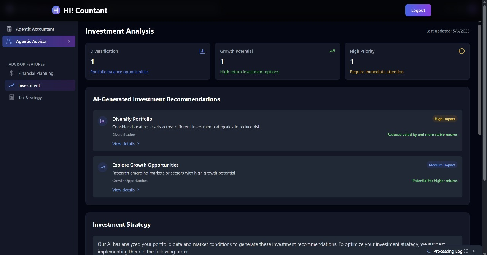
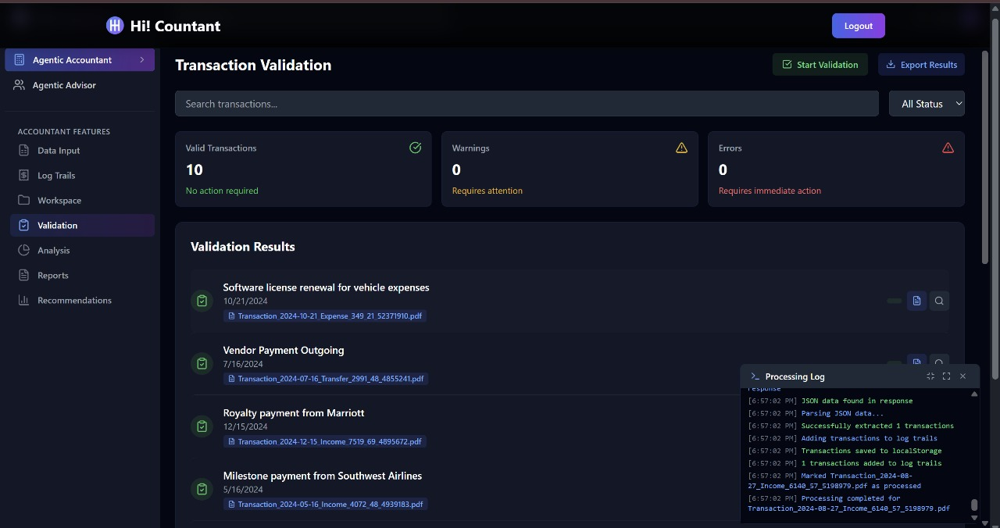
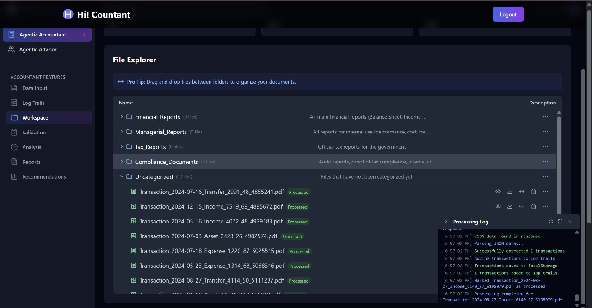

# Hi! Countant Documentation

<div align="center">
  
  <h3>AI-Powered Accounting & Financial Management Platform</h3>
  <p>Built on Internet Computer Protocol (ICP) using ICP Ninja IDE</p>
</div>

## Table of Contents
- [Overview](#overview)
- [Technical Stack](#technical-stack)
- [Project Structure](#project-structure)
- [Development Guide](#development-guide)
- [Core Features](#core-features)
- [Deployment](#deployment)
- [Assets & Branding](#assets--branding)
- [Troubleshooting](#troubleshooting)

## Overview

Hi! Countant is a pioneering fintech platform that combines artificial intelligence with blockchain technology to revolutionize accounting and financial management. Built on the Internet Computer Protocol, it leverages Gemini AI models to provide:

- 📊 AI-driven financial data analysis
- 💼 Automated transaction processing
- 📝 Comprehensive financial reporting
- 💡 Intelligent financial recommendations

## Technical Stack

- **Frontend**: React 18.3.1 with Vite 5.4.18
- **Backend**: Motoko on ICP
- **AI Models**: Google Gemini 2.5 Flash
- **Styling**: Tailwind CSS 3.4.14 with DaisyUI
- **Development Environment**: ICP Ninja IDE

## Project Structure

```text
/
├── backend/                           # Motoko canister code
│   └── app.mo                        # Main backend application with file storage and transactions
│
├── frontend/                         # React frontend application
│   ├── public/                      # Static assets
│   │   └── favicon.svg             # Application logo
│   │
│   ├── src/                        # Source code
│   │   ├── assets/                 # Image assets
│   │   │   ├── advisor_financial_planning.jpg  # Financial planning feature
│   │   │   ├── advisor_investment.jpg         # Investment advice feature
│   │   │   ├── advisor_investment2.jpg        # Investment strategies feature
│   │   │   ├── advisor_tax_strategy.jpg       # Tax strategy feature
│   │   │   ├── advisor_tax_strategy2.jpg      # Advanced tax planning feature
│   │   │   ├── analysis.jpg                   # Financial analysis screen
│   │   │   ├── data_input.jpg                 # Data input interface
│   │   │   ├── data_input2.jpg                # Advanced data input interface
│   │   │   ├── financial_report.jpg           # Financial report example
│   │   │   ├── generate_fake_transactions.jpg # Transaction generator tool
│   │   │   ├── homepage1.jpg                  # Homepage screenshot 1
│   │   │   ├── homepage2.jpg                  # Homepage screenshot 2
│   │   │   ├── homepage3.jpg                  # Homepage screenshot 3
│   │   │   ├── homepage4.jpg                  # Homepage screenshot 4
│   │   │   ├── log_trails.jpg                 # Audit log trails screen
│   │   │   ├── process_document_loading.jpg   # Document loading process
│   │   │   ├── process_document.jpg           # Document processing screen
│   │   │   ├── recommendations.jpg            # AI recommendations screen
│   │   │   ├── report_pdf.jpg                 # PDF report example
│   │   │   ├── report.jpg                     # Standard report example
│   │   │   ├── validation.jpg                 # Data validation screen
│   │   │   └── workspace.jpg                  # User workspace interface
│   │   │
│   │   ├── components/             # Reusable UI components
│   │   │   ├── Footer.jsx          # Footer component
│   │   │   ├── Navbar.jsx          # Navigation bar component
│   │   │   ├── Logo.jsx            # Logo component
│   │   │   ├── advisor/            # Financial advisor components
│   │   │   │   ├── Investment.jsx  # Investment recommendations
│   │   │   │   ├── TaxStrategy.jsx # Tax optimization strategies
│   │   │   │   └── FinancialPlanning.jsx # Financial planning tools
│   │   │   │
│   │   │   └── accountant/         # Accounting-specific components
│   │   │       ├── Workspace.jsx   # File workspace management
│   │   │       ├── FilePreview.jsx # Document preview component
│   │   │       ├── DocxPreview.jsx # Word document preview
│   │   │       ├── CSVPreview.jsx  # CSV file preview
│   │   │       ├── ExcelPreview.jsx # Excel file preview
│   │   │       ├── DataInput.jsx   # Data input component
│   │   │       ├── ManualDataInput.jsx # Manual transaction entry
│   │   │       ├── Validation.jsx  # Data validation component
│   │   │       ├── DocumentComparison.jsx # Compare documents
│   │   │       ├── Analysis.jsx    # Financial analysis component
│   │   │       ├── Reports.jsx     # Report generation component
│   │   │       ├── Recommendations.jsx # Financial recommendations
│   │   │       ├── LogTrails.jsx   # Audit log trails
│   │   │       ├── TransactionDetails.jsx # Transaction details view
│   │   │       └── ProcessingLog.jsx # Processing log component
│   │   │
│   │   ├── pages/                 # Application pages
│   │   │   ├── App.jsx            # Main application dashboard
│   │   │   ├── Home.jsx           # Landing page
│   │   │   ├── Documentation.jsx  # Documentation page
│   │   │   ├── Blog.jsx           # Blog page
│   │   │   ├── About.jsx          # About page
│   │   │   ├── Careers.jsx        # Careers page
│   │   │   ├── Contact.jsx        # Contact page
│   │   │   ├── Features.jsx       # Features page
│   │   │   ├── Pricing.jsx        # Pricing page
│   │   │   ├── Roadmap.jsx        # Roadmap page
│   │   │   ├── Privacypolicy.jsx  # Privacy policy page
│   │   │   ├── Termsofservices.jsx # Terms of service page
│   │   │   ├── Cookiepolicy.jsx   # Cookie policy page
│   │   │   └── GDPR.jsx           # GDPR compliance page
│   │   │
│   │   ├── utils/                # Utility functions
│   │   │   ├── documentPositionTracker.js # Track document positions
│   │   │   ├── toastNotification.js # Toast notification utility
│   │   │   └── pdfGenerator.js    # PDF generation utility
│   │   │
│   │   └── Main.jsx              # Application entry point with routing
│   │
│   ├── index.html                # HTML entry point
│   ├── index.css                # Global styles with Tailwind
│   ├── tailwind.config.js       # Tailwind CSS configuration
│   ├── postcss.config.js        # PostCSS configuration
│   ├── vite.config.js           # Vite configuration
│   └── package.json             # Frontend dependencies
│
├── .devcontainer/               # Development container configuration
│   └── devcontainer.json        # VS Code dev container settings
│
├── config/                      # Configuration files
│   └── dfx.json                # ICP canister configuration
│
├── mops.toml                    # Motoko package manager configuration
├── package.json                # Root package configuration
├── package-lock.json           # Dependency lock file
├── .gitignore                  # Git ignore rules
├── .dockerignore               # Docker ignore rules
├── Dockerfile                  # Docker configuration
├── restart-ii.sh               # Script to restart Internet Identity
├── BUILD.md                    # Build instructions
└── README.md                   # Project documentation
```

### Key Directories

- `backend/`: Contains the Motoko canister code for the ICP backend
- `frontend/`: React application with components, pages, and utilities
- `frontend/public/assets/`: Image assets and icons used throughout the application
- `frontend/src/components/advisor/`: Financial advisor components for investment and planning
- `frontend/src/components/accountant/`: Specialized components for accounting features
- `frontend/src/pages/`: Application pages including main app and marketing pages
- `frontend/src/utils/`: Utility functions for document tracking, notifications, and PDF generation
- `config/`: Project configuration files for ICP deployment

## Development Guide

### Prerequisites
- ICP Ninja IDE
- Web Browser (Chrome/Firefox recommended)
- Internet Computer Identity (for deployment)

### Development Options

#### Option 1: ICP Ninja IDE (Recommended for Quick Start)
1. Open ICP Ninja IDE in your browser
2. Create a new project or open existing
3. The IDE provides a temporary development environment valid for 20 minutes
4. Use the built-in deployment feature for testing

#### Option 2: Local Development with WSL (Windows)
1. Install Windows Subsystem for Linux (WSL)
   ```bash
   wsl --install
   ```

2. Install developer tools in WSL:
   ```bash
   curl -fsSL https://internetcomputer.org/install.sh | sh
   ```

3. Install Node.js and npm:
   ```bash
   curl -fsSL https://deb.nodesource.com/setup_20.x | sudo -E bash -
   sudo apt-get install -y nodejs
   ```

4. Install Motoko package manager:
   ```bash
   npm install -g ic-mops
   ```

5. Clone the repository and navigate to the project directory:
   ```bash
   git clone <repository-url>
   cd hi-countant
   ```

6. Install dependencies:
   ```bash
   npm install
   ```

7. Start the local ICP replica:
   ```bash
   dfx start
   ```

8. Deploy the canisters:
   ```bash
   dfx deploy
   ```

#### Option 3: Native Installation (macOS/Linux)
1. Install `dfx` with the following command:
   ```bash
   sh -ci "$(curl -fsSL https://internetcomputer.org/install.sh)"
   ```

2. Install Node.js and npm
3. Install Motoko package manager: `npm install -g ic-mops`
4. Clone the repository and navigate to the project directory
5. Install dependencies: `npm install`
6. Start the local ICP replica: `dfx start`
7. Deploy the canisters: `dfx deploy`

#### Option 4: Docker Development
Use the provided Dockerfile for a containerized development environment:
```bash
docker build -t hi-countant .
docker run -p 4943:4943 -p 5173:5173 hi-countant
```

## Core Features

### AI-Powered Document Processing
The application can process various document types and extract financial information:

```javascript
// Process documents with Gemini AI
const response = await fetch(
  `https://generativelanguage.googleapis.com/v1beta/models/gemini-2.5-flash-preview-04-17:generateContent?key=${GEMINI_API_KEY}`,
  {
    method: "POST",
    headers: {
      "Content-Type": "application/json",
    },
    body: JSON.stringify({
      contents: [
        {
          parts: [{ text: prompt }],
        },
      ],
    }),
  }
);
```

### Document Management Workspace
Organize financial documents in a structured workspace with categorized folders:

- Financial Reports
- Managerial Reports
- Tax Reports
- Uncategorized

### Multi-format Document Support
Process and preview various document formats:
- Word documents (DOCX)
- Excel spreadsheets (XLSX)
- CSV files
- PDF documents

## Deployment

### Local Deployment
1. Start the local ICP replica:
   ```bash
   dfx start
   ```

2. Deploy the canisters:
   ```bash
   dfx deploy
   ```

3. The frontend will be available at: http://127.0.0.1:4943/?canisterId=[canister-id]

### ICP Ninja IDE Deployment
1. Build & Deploy process through the IDE interface
2. Mainnet deployment steps as outlined in BUILD.md

### Mainnet Deployment
1. Ensure you have cycles available
2. Deploy to the mainnet:
   ```bash
   dfx deploy --network ic
   ```

### Environment Configuration
```env
VITE_CANISTER_ID=<canister-id>
VITE_HOST=https://ic0.app  # For production
GEMINI_API_KEY=<your-api-key>  # For AI functionality
```

## Assets Gallery

### Application Logo


### Homepage Screenshots
<div style="display: flex; flex-wrap: wrap; gap: 20px; margin-bottom: 20px;">
  <div style="text-align: center;">
    
    <p>Homepage View 1</p>
  </div>
  <div style="text-align: center;">
    
    <p>Homepage View 2</p>
  </div>
  <div style="text-align: center;">
    
    <p>Homepage View 3</p>
  </div>
  <div style="text-align: center;">
    
    <p>Homepage View 4</p>
  </div>
</div>

### Financial Advisor Features
<div style="display: flex; flex-wrap: wrap; gap: 20px; margin-bottom: 20px;">
  <div style="text-align: center;">
    
    <p>Financial Planning</p>
  </div>
  <div style="text-align: center;">
    
    <p>Investment Advice</p>
  </div>
  <div style="text-align: center;">
    
    <p>Investment Strategies</p>
  </div>
  <div style="text-align: center;">
    
    <p>Tax Strategy</p>
  </div>
  <div style="text-align: center;">
    
    <p>Advanced Tax Planning</p>
  </div>
</div>

### Agentic Accountant
<div style="display: flex; flex-wrap: wrap; gap: 20px; margin-bottom: 20px;">
  <div style="text-align: center;">
    
    <p>Document Loading</p>
  </div>
  <div style="text-align: center;">
    
    <p>Document Processing</p>
  </div>
  <div style="text-align: center;">
    
    <p>Document Validation</p>
  </div>
</div>

### Data Management
<div style="display: flex; flex-wrap: wrap; gap: 20px; margin-bottom: 20px;">
  <div style="text-align: center;">
    
    <p>Data Input</p>
  </div>
  <div style="text-align: center;">
    
    <p>Advanced Data Input</p>
  </div>
  <div style="text-align: center;">
    
    <p>Transaction Generator</p>
  </div>
  <div style="text-align: center;">
    
    <p>Log Trails</p>
  </div>
</div>

### Analysis & Reporting
<div style="display: flex; flex-wrap: wrap; gap: 20px; margin-bottom: 20px;">
  <div style="text-align: center;">
    
    <p>Financial Analysis</p>
  </div>
  <div style="text-align: center;">
    
    <p>Financial Report</p>
  </div>
  <div style="text-align: center;">
    
    <p>Standard Report</p>
  </div>
  <div style="text-align: center;">
    
    <p>PDF Report</p>
  </div>
  <div style="text-align: center;">
    
    <p>AI Recommendations</p>
  </div>
</div>

### Workspace
<div style="display: flex; flex-wrap: wrap; gap: 20px; margin-bottom: 20px;">
  <div style="text-align: center;">
    
    <p>User Workspace</p>
  </div>
</div>

## Troubleshooting

### Common Issues
1. **Canister Deployment Failed**
   - Check cycles balance
   - Verify canister settings
   - Ensure proper identity configuration

2. **WSL Development Issues**
   - Ensure WSL is properly installed: `wsl --status`
   - Check if dfx is installed correctly: `dfx --version`
   - Verify Node.js installation: `node --version`
   - Make sure ports 4943 and 5173 are not in use

3. **Development Container Issues**
   - Ensure Docker is running
   - Check port availability (4943, 5173)
   - Verify VS Code extensions

4. **API Integration Issues**
   - Verify Gemini API key is correctly set
   - Check network connectivity
   - Examine browser console for errors

5. **Image Asset Issues**
   - Ensure all assets are in the correct directory (`frontend/public/assets/`)
   - Verify file paths in components are correct
   - Check for case sensitivity in file names
